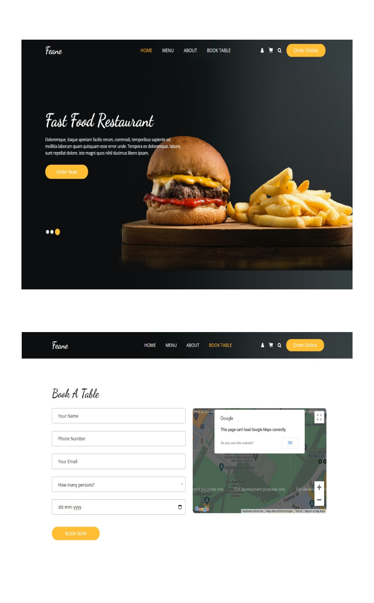
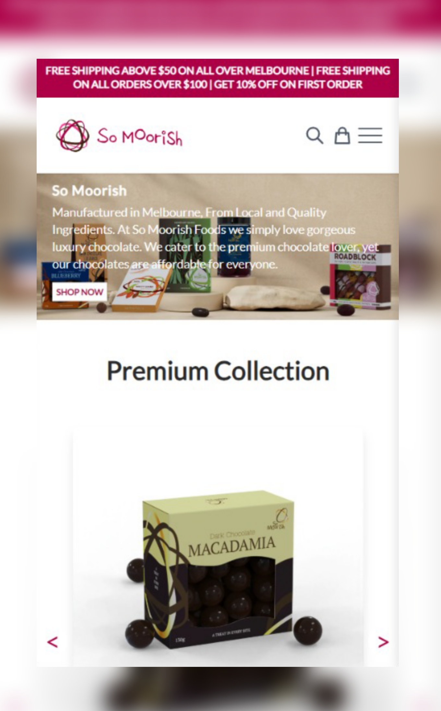
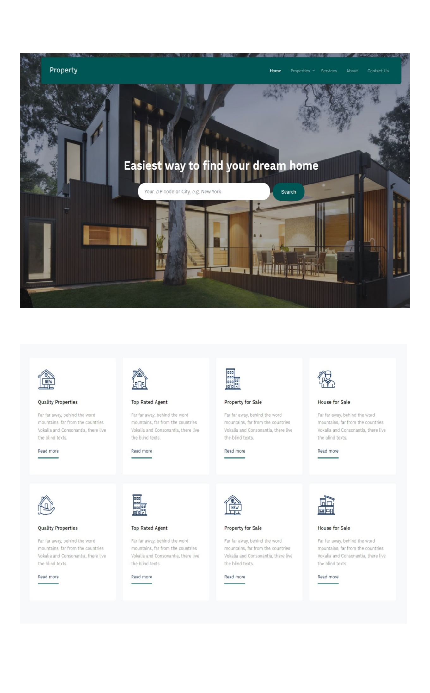
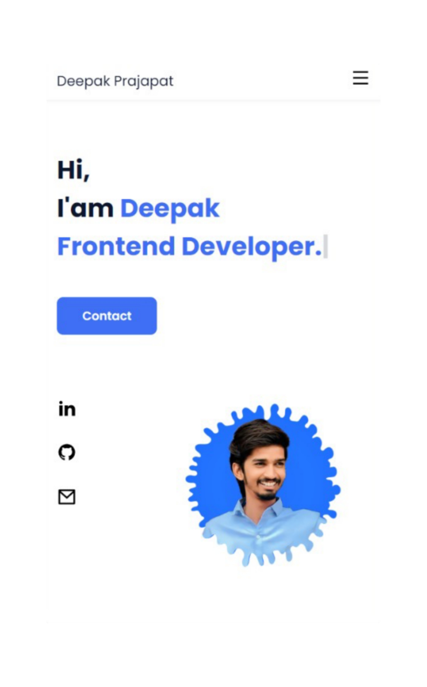

<!DOCTYPE html>
<html lang="en">
<head>
    <meta charset="UTF-8">
    <meta name="viewport" content="width=device-width, initial-scale=1.0">
    <title>My Portfolio</title>
    <link rel="stylesheet" href="style.css">
    <link rel="stylesheet" href="utils.css"> 
    <link rel="stylesheet" href="responsive.css"> 
    <link rel="stylesheet" href="https://cdnjs.cloudflare.com/ajax/libs/remixicon/3.5.0/remixicon.css" integrity="sha512-HXXR0l2yMwHDrDyxJbrMD9eLvPe3z3qL3PPeozNTsiHJEENxx8DH2CxmV05iwG0dwoz5n4gQZQyYLUNt1Wdgfg==" crossorigin="anonymous" referrerpolicy="no-referrer" />
</head>
<body>
    <header class="header flex sp-bw">
        <nav class="container flex sp-bw al-center px-1">
            

                <h3>Deepak Prajapat</h3>
            

            

                <svg class="menu" xmlns="http://www.w3.org/2000/svg" viewBox="0 0 24 24"><path d="M3 4H21V6H3V4ZM3 11H21V13H3V11ZM3 18H21V20H3V18Z"></path></svg>
            

            

                    <a class="nav__links active" href="#">Home</a>
                    <a class="nav__links" href="#about">About</a>
                    <a class="nav__links" href="#skills">Skills</a>
                    <a class="nav__links" href="#work">Work</a>
                    <a class="nav__links" href="#interests">Interests</a>
                    <a class="nav__links" href="#contact_link">Conatct</a>
            

        </nav>
        

            <a class="nav__links  sidebar_links active" href="#">Home</a>
                <a class="nav__links  sidebar_links" href="#about">About</a>
                <a class="nav__links  sidebar_links" href="#skills">Skills</a>
                <a class="nav__links  sidebar_links" href="#work">Work</a>
                <a class="nav__links  sidebar_links" href="#contact_link">Conatct</a>
        

    </header>

    <main class="main px-1">
        <section class="section home container" id="home">
            

                <h1>Hi,  
                    I'am Deepak  
                    <!-- and I'm a passionate   -->
                    
                </h1>
                <a href="#contact_link" class="button">Contact</a>
               

            

            

                <ul class="social_links flex fx-dir">
                    <li><a href="https://www.linkedin.com/in/deepak-prajapat-2ba052218/?originalSubdomain=in"><svg xmlns="http://www.w3.org/2000/svg" viewBox="0 0 24 24"><path d="M6.94048 4.99993C6.94011 5.81424 6.44608 6.54702 5.69134 6.85273C4.9366 7.15845 4.07187 6.97605 3.5049 6.39155C2.93793 5.80704 2.78195 4.93715 3.1105 4.19207C3.43906 3.44699 4.18654 2.9755 5.00048 2.99993C6.08155 3.03238 6.94097 3.91837 6.94048 4.99993ZM7.00048 8.47993H3.00048V20.9999H7.00048V8.47993ZM13.3205 8.47993H9.34048V20.9999H13.2805V14.4299C13.2805 10.7699 18.0505 10.4299 18.0505 14.4299V20.9999H22.0005V13.0699C22.0005 6.89993 14.9405 7.12993 13.2805 10.1599L13.3205 8.47993Z"></path></svg></a></li>
                    <li><a href="https://github.com/DeepakPrajapat2121"><svg xmlns="http://www.w3.org/2000/svg" viewBox="0 0 24 24"><path d="M12.001 2C6.47598 2 2.00098 6.475 2.00098 12C2.00098 16.425 4.86348 20.1625 8.83848 21.4875C9.33848 21.575 9.52598 21.275 9.52598 21.0125C9.52598 20.775 9.51348 19.9875 9.51348 19.15C7.00098 19.6125 6.35098 18.5375 6.15098 17.975C6.03848 17.6875 5.55098 16.8 5.12598 16.5625C4.77598 16.375 4.27598 15.9125 5.11348 15.9C5.90098 15.8875 6.46348 16.625 6.65098 16.925C7.55098 18.4375 8.98848 18.0125 9.56348 17.75C9.65098 17.1 9.91348 16.6625 10.201 16.4125C7.97598 16.1625 5.65098 15.3 5.65098 11.475C5.65098 10.3875 6.03848 9.4875 6.67598 8.7875C6.57598 8.5375 6.22598 7.5125 6.77598 6.1375C6.77598 6.1375 7.61348 5.875 9.52598 7.1625C10.326 6.9375 11.176 6.825 12.026 6.825C12.876 6.825 13.726 6.9375 14.526 7.1625C16.4385 5.8625 17.276 6.1375 17.276 6.1375C17.826 7.5125 17.476 8.5375 17.376 8.7875C18.0135 9.4875 18.401 10.375 18.401 11.475C18.401 15.3125 16.0635 16.1625 13.8385 16.4125C14.201 16.725 14.5135 17.325 14.5135 18.2625C14.5135 19.6 14.501 20.675 14.501 21.0125C14.501 21.275 14.6885 21.5875 15.1885 21.4875C19.259 20.1133 21.9999 16.2963 22.001 12C22.001 6.475 17.526 2 12.001 2Z"></path></svg></a></li>
                    <li><a href="https://mail.google.com/mail/u/0/#chats?compose=new"><svg xmlns="http://www.w3.org/2000/svg" viewBox="0 0 24 24"><path d="M3 3H21C21.5523 3 22 3.44772 22 4V20C22 20.5523 21.5523 21 21 21H3C2.44772 21 2 20.5523 2 20V4C2 3.44772 2.44772 3 3 3ZM20 7.23792L12.0718 14.338L4 7.21594V19H20V7.23792ZM4.51146 5L12.0619 11.662L19.501 5H4.51146Z"></path></svg>
                    </a></li>
                </ul>
            

            

                
            

        </section>
        <!-- *****  ABOUT ***** -->
        <section class="about section  container" id="about">
            <h2 class="section_title">About</h2>
            

                

                    
                

                

                    <h2 class="about_title  mx-1">
                        I'am Deepak
                    </h2>
                    
Passionate and driven web developer with a strong foundation in the basics of web development. Eager to bring creativity and problem-solving skills to create dynamic and user-friendly websites. Committed to continuous learning and staying abreast of industry trends. Ready to contribute innovative solutions to collaborative projects.

                

                <a href="resume.pdf" class="button">Resume</a>
            

        </section>

        <!-- ****** SKILLS ******** -->
        <section class="section skills container" id="skills"> 
            <h2 class="section_title">Skills</h2>
            

                

                    

                        <h2 class="skill_title  mx-2">
                            Professional Skills
                        </h2>
                        

                            <ul>
                                <li><strong>Programming Languages:</strong> C/C++, Java, and basic knowledge of Python.</li>
                                <li><strong>Web Development:</strong> Strong skills in HTML, CSS, and JavaScript for creating responsive and visually appealing web applications.</li>
                <!-- <li><strong>Object-Oriented Programming (OOP):</strong> Well-versed in the principles of OOP for designing efficient and modular code.</li> -->
                <!-- <li><strong> Data Structures and Algorithms (DSA):</strong> Solid understanding and implementation of fundamental data structures and algorithms for optimized problem-solving.</li> -->
                <!-- <li><strong>.NET Framework:</strong>  Basic knowledge in .NET, showcasing adaptability to different development environments.</li> -->
                            </ul>
                        

                    

                    

                        

                            <i class="ri-html5-fill"></i>
                            

                                HTML5
                                95%
                            

                        

                        

                            <i class="ri-css3-fill"></i>
                            

                                CSS3
                                85%
                            

                        

                        

                            <i class="ri-javascript-fill"></i>
                            

                                JAVASCRIPT
                                65%
                            

                        

                    

                

                

                    
                

            

        </section>

        <!-- ****** WORK ******** -->
        <section class="section work container" id="work">
            <h2 class="section_title">WORK</h2>
            

                
                
                <a href="#" class="work_img">
                 
                    

                        <h3>Login & Sign up Page</h3>
                    

                </a>
                <a href="#" class="work_img">
                    
                    

                        <h3>Food Restaurant</h3>
                    

                </a>
                <a href="#" class="work_img">
                    
                    

                        <h3>Copy Brand Website</h3>
                    

                </a>
                <a href="#" class="work_img">
                    
                    

                        <h3>Property Deal</h3>
                    

                </a>
                <a href="#" class="work_img">
                    
                    

                        <h3>Marketing</h3>
                    

                </a>
                <a href="#" class="work_img">
                    
                    

                        <h3>Responsive Portfolio</h3>
                    

                </a>
            

        </section>
    </main>

    <section class="section work container" id="interests">
        <h2 class="section_title">Interests</h2>
        

            <a href="#" class="work_img">
                
                

                    <h3>Cooking</h3>
                

            </a>

            <a href="#" class="work_img">
                
                

                    <h3>Gaming</h3>
                

            </a>

            <a href="#" class="work_img">
                
                

                    <h3>Adventure</h3>
                

            </a>

        </section>

    <footer class="my_footer flex al-center js-center">
        

            <h2 class="footer_title">Deepak</h2>
            

                <a href="https://web.whatsapp.com/"><i class="ri-whatsapp-fill"></i></a>
                <a href="#"><i class="ri-twitter-fill"></i></a>
                <a href="https://www.instagram.com/_deepak_._prajapat_?igsh=MWJyZ3FuMWFtZnhjNw=="><i id="insta" class="ri-instagram-fill"></i></a>
            

        

    </footer>

    
    <!--===== SCROLL REVEAL =====-->
    

    
</body>
</html>
